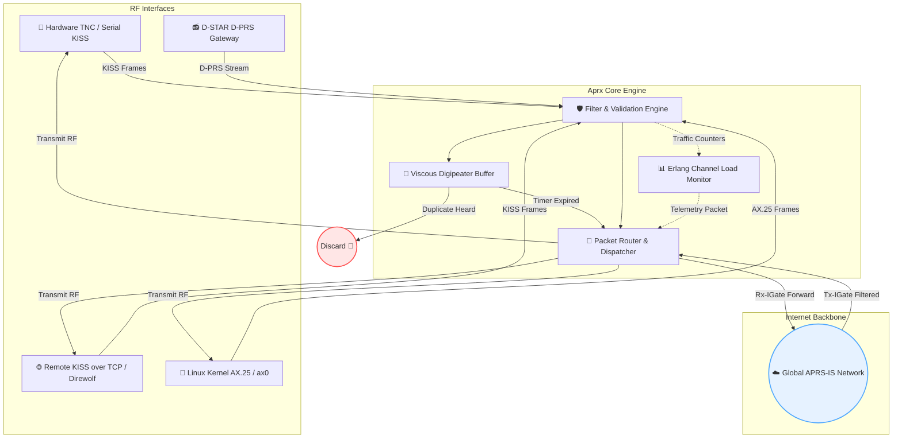

<div align="center">
  
# 📡 APRX

**Advanced Amateur Radio APRS IGate & Digipeater**

[](LICENSE)
[]()
[](https://github.com/9M2PJU/aprx/actions/workflows/release.yml)
[]()

*A highly versatile, ultra-lightweight gateway bridging the RF amateur radio world and the global APRS-IS network.*

---
</div>

## 📦 Pre-Built Releases & Packages

Every commit to `master` and release tag triggers automated builds generating native packages and standalone archive bundles available on the **[Releases](https://github.com/9M2PJU/aprx/releases)** page:

### 1. Native Distribution Packages
Install directly using your system's package manager:

| OS / Distribution | Architecture | Package File | Install Command |
| :--- | :--- | :--- | :--- |
| **Debian** | `x86_64` | `aprx-2.9.1-debian-x86_64.deb` | `sudo dpkg -i aprx-2.9.1-debian-x86_64.deb` |
| **Ubuntu** | `x86_64` | `aprx-2.9.1-ubuntu-x86_64.deb` | `sudo dpkg -i aprx-2.9.1-ubuntu-x86_64.deb` |
| **Fedora / RHEL** | `x86_64` | `aprx-2.9.1-fedora-x86_64.rpm` | `sudo dnf install aprx-2.9.1-fedora-x86_64.rpm` |
| **Arch Linux** | `x86_64` | `aprx-2.9.1-archlinux-x86_64.pkg.tar.zst` | `sudo pacman -U aprx-2.9.1-archlinux-x86_64.pkg.tar.zst` |
| **FreeBSD** | `x86_64` | `aprx-2.9.1-freebsd-x86_64.pkg` | `sudo pkg add aprx-2.9.1-freebsd-x86_64.pkg` |

### 2. Standalone Binary Archives (`.tar.gz`)
Each archive contains the compiled executable binary (`aprx`), sample configuration template (`aprx.conf.in`), documentation, and license:

| Platform | Target Architecture | Archive Filename |
| :--- | :--- | :--- |
| **Raspberry Pi (64-bit)** | `arm64` / `aarch64` | `aprx-2.9.1-raspberrypi-arm64.tar.gz` |
| **Raspberry Pi (32-bit)** | `armhf` / `armv7` | `aprx-2.9.1-raspberrypi-armhf.tar.gz` |
| **macOS (Apple Silicon)** | `arm64` (M1/M2/M3/M4) | `aprx-2.9.1-macos-arm64.tar.gz` |
| **Linux (Universal)** | `x86_64` | `aprx-2.9.1-ubuntu-x86_64.tar.gz` / `debian` / `fedora` / `archlinux` |
| **FreeBSD** | `x86_64` | `aprx-2.9.1-freebsd-x86_64.tar.gz` |

---

## 🌟 What is APRS?

**Automatic Packet Reporting System (APRS)** is an amateur radio communications system designed for exchanging tactical, real-time data across local radio networks and the global Internet. Developed by Bob Bruninga (**WB4APR**), APRS supports:
- 📍 **GPS Position Tracking:** Stations, vehicles, high-altitude balloons, and maritime objects.
- 🌦️ **Weather Station Telemetry:** Real-time wind speed, rainfall, temperature, and humidity.
- ✉️ **Two-Way Messaging:** Free-form text messages, bulletins, and emergency disaster traffic.

Packets are transmitted over VHF frequencies (**144.390 MHz** in North America, **144.800 MHz** in Europe, **144.390 MHz** in Malaysia/Asia) and bridged to the internet via the global **APRS-IS** backbone.

---

## 🚀 What is Aprx?

**Aprx** is a high-performance, lightweight, and dedicated APRS IGate (Internet Gateway) and Digipeater daemon designed for Unix-like operating systems (Linux, FreeBSD, macOS). It is engineered for maximum reliability with minimal CPU and memory footprints, making it the gold standard for low-power embedded platforms (Raspberry Pi, OpenWrt routers, embedded x86).

Unlike legacy APRS software, Aprx:
- **Does not require native AX.25 kernel modules** (runs entirely in user-space using direct KISS serial / TCP connections), though it can attach to Linux kernel AX.25 network interfaces if desired.
- Implements the intelligent **Viscous Digipeater** algorithm to eliminate packet collisions on RF channels.
- Supports multi-port and cross-band digipeating with comprehensive path filtering and callsign sanitization.

---

## 🛠️ Key Capabilities

### 1️⃣ Internet Gateway (IGate)
- **Rx-IGate (RF ➡️ APRS-IS):** Receives packets from radio modems (TNCs, soundmodems), validates callsigns, checks paths, and forwards legitimate traffic to APRS-IS servers.
- **Tx-IGate (APRS-IS ➡️ RF):** Subscribes to APRS-IS server filters, filters messages directed to heard local stations, and transmits them back onto the RF channel without broadcasting unnecessary global traffic.

### 2️⃣ Viscous Digipeater
Standard digipeaters blindly repeat packets as soon as they hear them, causing collisions when multiple stations transmit simultaneously. 

Aprx's **Viscous Digipeater** algorithm:
1. Receives a packet and holds it in a short, configurable delay buffer (e.g., 200–500 ms).
2. Listens to the frequency during this delay.
3. If another digipeater retransmits the same packet first, Aprx **drops** its transmission.
4. If no other station repeats it, Aprx transmits. This drastically reduces RF channel congestion.

---

## 🏗️ Architecture & Packet Flow



---

## 🔧 Building from Source

### Dependencies
- **Debian / Ubuntu / Raspberry Pi OS:**
  ```bash
  sudo apt-get update && sudo apt-get install -y build-essential libssl-dev git perl
  ```
- **Fedora / RHEL:**
  ```bash
  sudo dnf install -y gcc make openssl-devel git perl
  ```
- **Arch Linux:**
  ```bash
  sudo pacman -S base-devel openssl perl git
  ```
- **FreeBSD:**
  ```bash
  pkg install gmake perl5 git
  ```

### Build & Install
```bash
git clone https://github.com/9M2PJU/aprx.git
cd aprx
./configure --prefix=/usr --sysconfdir=/etc
make
sudo make install
```

---

## ⚙️ Configuration & Quick Start

1. **Copy sample configuration:**
   ```bash
   sudo cp aprx.conf.in /etc/aprx.conf
   ```
2. **Edit `/etc/aprx.conf` with your station details:**
   ```ini
   mycall    9M2PJU-10
   
   <aprsis>
     passcode  12345
     server    rotate.aprs2.net  14580
   </aprsis>
   
   <interface>
     serial-device /dev/ttyUSB0 9600 8n1 KISS
     callsign      $mycall
     tx-ok         true
   </interface>
   
   <beacon>
     beaconmode both
     cycle-size 20m
     beacon symbol "I#" lat "0308.50N" lon "10141.50E" comment "Aprx RX-IGate & Digipeater"
   </beacon>
   ```
3. **Run Aprx in foreground (debug mode):**
   ```bash
   aprx -dd -v -f /etc/aprx.conf
   ```
4. **Run as a systemd service:**
   ```bash
   sudo systemctl enable --now aprx
   sudo systemctl status aprx
   ```

---

## 🤝 Credits & Maintainers

* 🧑‍💻 **Matti Aarnio (OH2MQK):** Original author & architect (2007–2014)
* 🧑‍💻 **Kenneth W. Finnegan (W6KWF):** Longtime upstream maintainer (2014–Present)
* 🧑‍💻 **9M2PJU:** CI/CD modern packaging & cross-platform automation pipeline

<div align="center">
  <br>
  <a href="http://thelifeofkenneth.com/aprx">🌍 Project Homepage</a>
  <span>&nbsp;&nbsp;•&nbsp;&nbsp;</span>
  <a href="https://github.com/9M2PJU/aprx">💻 GitHub Repository</a>
  <span>&nbsp;&nbsp;•&nbsp;&nbsp;</span>
  <a href="http://groups.google.com/group/aprx-software">💬 Google Group</a>
</div>
