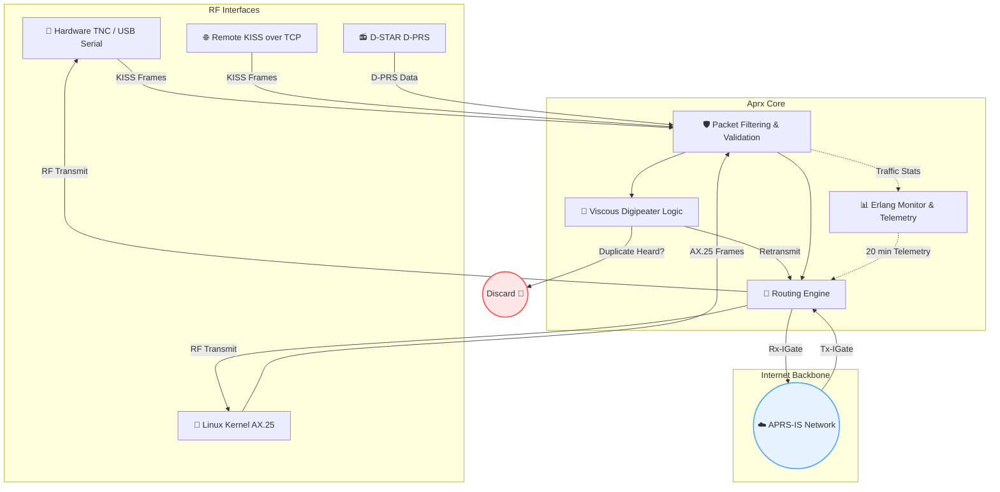

<div align="center">
  
# 📡 APRX

**Advanced APRS IGate & Digipeater**

[](LICENSE)
[]()
[]()

*A highly versatile, lightweight gateway bridging the RF world and the internet.*

---
</div>

## 📦 Installation

Automated builds provide pre-compiled packages for various distributions on every push to `master`. You can download the latest `.deb`, `.rpm`, `.pkg.tar.zst` (Arch Linux), and `.pkg` (FreeBSD) from the [Releases](https://github.com/9M2PJU/aprx/releases) page.

Alternatively, you can build from source.

## 🌟 What is APRS?

**Automatic Packet Reporting System (APRS)** is an amateur radio-based system for real-time digital communications. Developed by Bob Bruninga (WB4APR), it is widely used for:
- 📍 Tracking GPS coordinates
- 🌦️ Weather station telemetry
- ✉️ Text messages & emergency announcements

Data is transmitted over radio frequencies (typically **144.390 MHz** in North America, **144.800 MHz** in Europe) and is bridged to the internet via the global **APRS-IS** network.

## 🚀 Introducing Aprx

Aprx (currently **v2.9**) is a robust daemon running on Unix-like systems (Linux, BSD). It is especially popular on low-power, embedded hardware like the Raspberry Pi or custom router boards. 

Unlike many older APRS programs, Aprx **does not** strictly require the OS to have native AX.25 kernel support, though it can seamlessly integrate with it if present. It processes raw KISS frames from TNCs or D-PRS data, evaluates routing rules, and acts as a sophisticated bridge.

## 🛠️ How Aprx Works

Aprx performs two primary functions flawlessly:

<details>
<summary><b> 1️⃣ Internet Gateway (IGate)</b></summary>
<br>

- **Rx-IGate:** Listens to local RF traffic, validates it, and forwards legitimate APRS packets to the global APRS-IS backbone.
- **Tx-IGate:** Subscribes to specific geographic or callsign-based filters from APRS-IS and transmits relevant packets back out to the local RF network.

</details>

<details>
<summary><b> 2️⃣ Viscous Digipeater</b></summary>
<br>

One of Aprx's most powerful features is its **Viscous Digipeater** algorithm. 
Standard digipeaters blindly retransmit packets, which quickly leads to channel congestion and collisions. 

The Viscous Digipeater introduces an intentional delay. If it hears another station repeat the exact same packet during this waiting period, it **aborts** its own transmission. This significantly reduces RF clutter and improves overall network efficiency.

</details>

## 🏗️ Architecture & Packet Flow

The following diagram illustrates how Aprx processes and routes incoming traffic:



## ✨ Key Features

| Feature | Description |
| :--- | :--- |
| **🔌 Broad Modem Support** | Works natively with classical serial ports, USB adapters, remote TCP serial ports, and various KISS protocol variants. |
| **🛡️ Advanced Filtering** | Automatically drops invalid sources (`WIDE`, `RELAY`, `TRACE`, `NOCALL`) and respects APRS routing exclusions (`RFONLY`, `NOGATE`, `TCPIP`). |
| **📊 Built-in Telemetry** | The internal `erlang-monitor` calculates channel traffic load across all interfaces and broadcasts this as APRS telemetry every 20 minutes. |
| **🔀 Cross-Interface Routing**| Can route packets intelligently between multiple RF interfaces and APRS-IS. |
| **🐧 OS Flexibility** | Works flawlessly entirely in user-space, but can connect to promiscuous Linux Kernel AX.25 interfaces if configured. |

## ⚡ Quick Start

1. **Configure:** Edit the configuration file (default location is `/etc/aprx.conf`).
2. **Run:** Start the daemon using standard service commands or directly from the CLI:
   ```bash
   aprx -f /etc/aprx.conf
   ```
3. **Debug:** Use runtime options like `-v` (verbose) or `-d` (debug) for troubleshooting.

## 🤝 Credits & Authors

Aprx is an open-source project made possible by the contributions of the amateur radio community.

* 🧑‍💻 **Matti Aarnio (OH2MQK):** Original author and maintainer (2007-2014)
* 🧑‍💻 **Kenneth W. Finnegan (W6KWF):** Current maintainer (2014-Present)

<div align="center">
  <br>
  <a href="http://thelifeofkenneth.com/aprx">🌍 Project Homepage</a>
  <span>&nbsp;&nbsp;•&nbsp;&nbsp;</span>
  <a href="https://github.com/PhirePhly/aprx/">💻 Source Repository</a>
  <span>&nbsp;&nbsp;•&nbsp;&nbsp;</span>
  <a href="http://groups.google.com/group/aprx-software">💬 Google Group</a>
</div>
